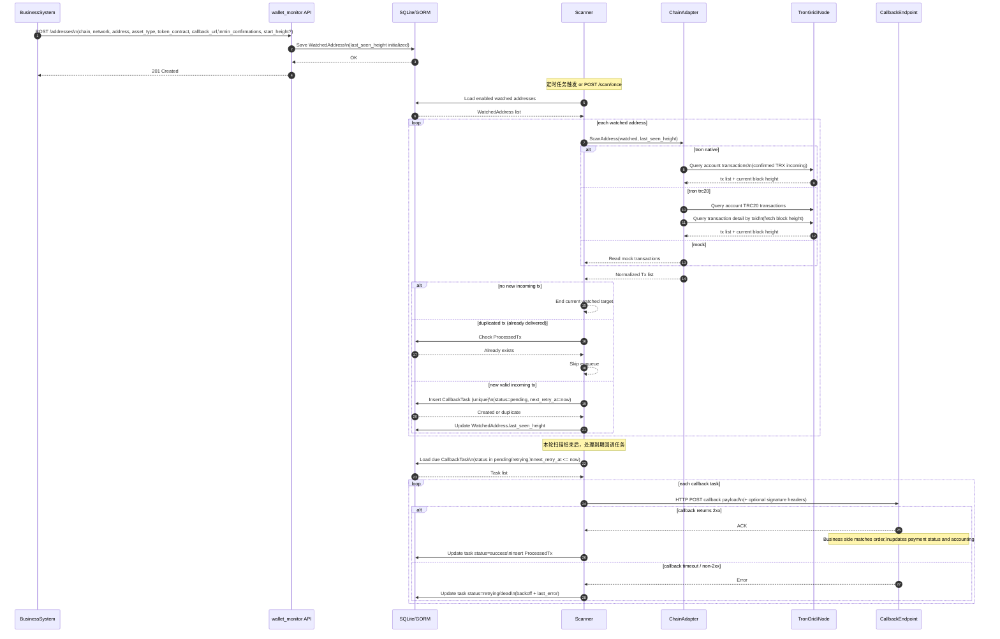
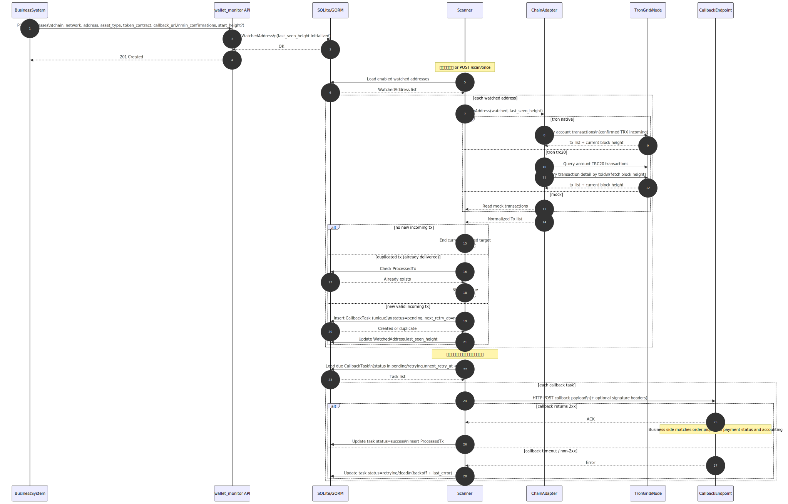

# 业务链调用流程图

## 1. 文件说明

本文件用于说明支付业务系统接入 `wallet_monitor` 后的整体调用链路。

配套 SVG：

- `wallet_monitor/docs/business_call_flow.svg`

直接打开 SVG 即可查看完整流程图。

## 2. Mermaid 时序图

## 3. SVG 预览

## 4. 主流程说明

### 4.1 注册监控地址

业务系统在创建收款订单或生成收款地址后，调用监控服务：

- `POST /addresses`

请求中通常包含：

- `chain`
- `network`
- `address`
- `asset_type`
- `token_contract`（TRC20 时需要）
- `callback_url`

监控服务收到后会把监控目标写入 `WatchedAddress` 表。

### 4.2 定时扫描

监控服务会周期性触发扫描，或者手动调用：

- `POST /scan/once`

扫描时会：

1. 从数据库读取所有 `enabled = true` 的地址；
2. 按 `chain / network / asset_type` 选择对应扫描适配器；
3. 带着 `last_seen_height` 去链上查询增量入账。

## 5. 链上查询逻辑

当前已支持：

- `tron + native`：已确认 `TRX` 入账
- `tron + trc20`：已确认 `TRC20` 入账
- `mock`：本地联调

查询结果返回后，监控服务会：

- 判断是否有新交易；
- 检查 `ProcessedTx` 去重；
- 更新 `last_seen_height`；
- 对需要回调的交易生成统一回调 payload。

## 6. 回调阶段

当发现新的有效入账时，监控服务会向业务方的回调地址发起：

- `HTTP POST callback_url`

回调内容包含（见 `CallbackPayload`）：

- `chain`
- `network`
- `asset_type`
- `token_contract`
- `token_symbol`
- `token_decimals`
- `address`
- `tx_hash`
- `from`
- `to`
- `amount`
- `block_height`

业务方返回 `2xx` 后，监控服务会记录该交易为已处理，避免重复通知。

## 7. 分支说明

### 7.1 无新交易

如果链上没有发现新入账：

- 本轮扫描结束；
- 等待下一轮定时扫描。

### 7.2 重复交易

如果交易已经存在于 `ProcessedTx`：

- 不重复回调；
- 直接跳过。

### 7.3 回调失败

当前版本行为（生产可用的最小闭环）：

- 扫描阶段只负责把回调写入 `CallbackTask` 作为“持久化队列”，不会因为一次回调失败就丢单；
- 回调发送由任务执行器处理：失败会写入 `last_error`，并按指数退避更新 `next_retry_at`；
- 超过最大重试次数会进入 `dead` 状态，可通过管理接口手动重试。

## 8. 适合对外讲的总结

这套链路可以概括成一句话：

**业务系统只负责注册收款地址和接收回调，监控服务负责扫链、判定入账、去重和通知。**
