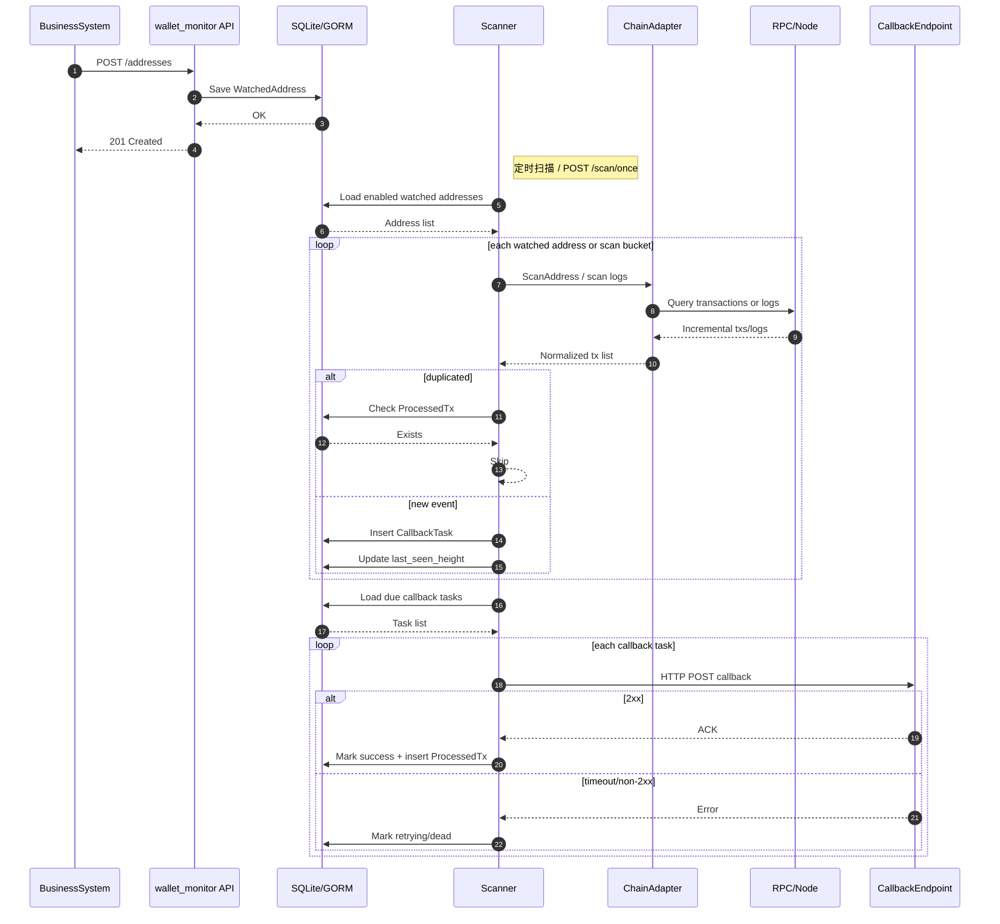

# 业务调用流程

本文档说明业务系统接入 `wallet_monitor` 后的调用链路，以及监控服务内部如何完成扫链、入队、回调和去重。

配套文件：
- Mermaid 源文件：`business_call_flow.mmd`
- SVG 图：`business_call_flow.svg`

## 1. 一句话说明

**业务系统只负责注册地址和接收回调；`wallet_monitor` 负责扫链、确认数判断、幂等去重、回调重试和死信管理。**

## 2. 业务方最小接入步骤

如果从业务方视角看，最小接入只需要完成下面 3 步：

### 2.1 第一步：创建订单并生成收款地址

例如业务系统创建了一笔订单：

- `order_no = PAY202603220001`
- `user_id = 10001`
- 收款链：`tron mainnet`
- 收款币种：`USDT(TRC20)`
- 收款地址：`TYo5GrzZGGnzrSMp2eQ8QR352RDTrwrgkQ`
- 回调地址：`https://pay-api.example.com/wallet/callback`

### 2.2 第二步：把收款地址注册给 `wallet_monitor`

业务系统调用：

- `POST /addresses`

### 2.3 第三步：等待回调

当链上真的有入账，且达到确认数后，`wallet_monitor` 会把结果主动 `POST` 到你的业务回调地址。

---

## 3. 主流程

### 3.1 注册监控地址
业务系统创建收款订单或生成收款地址后，调用：

- `POST /addresses`

监控服务会把监控目标写入 `WatchedAddress`，并初始化扫描进度：
- TRON / EVM 在未传 `start_height` 时，会把 `last_seen_height` 初始化为“当前已确认高度”，默认不回填历史
- 如需回填，必须显式传 `start_height`

#### 示例 1：注册 TRON 原生币地址

```bash
curl -X POST http://127.0.0.1:8080/addresses \
  -H 'Authorization: Bearer <ADMIN_TOKEN>' \
  -H 'Content-Type: application/json' \
  -d '{
    "chain": "tron",
    "network": "mainnet",
    "address": "TE6tpVvcdAn1Sg7fYjkgeaWnabnzzxCdir",
    "asset_type": "native",
    "callback_url": "https://pay-api.example.com/wallet/callback",
    "min_confirmations": 3
  }'
```

#### 示例 2：注册 TRON USDT(TRC20) 地址

```bash
curl -X POST http://127.0.0.1:8080/addresses \
  -H 'Authorization: Bearer <ADMIN_TOKEN>' \
  -H 'Content-Type: application/json' \
  -d '{
    "chain": "tron",
    "network": "mainnet",
    "address": "TYo5GrzZGGnzrSMp2eQ8QR352RDTrwrgkQ",
    "asset_type": "trc20",
    "token_contract": "TR7NHqjeKQxGTCi8q8ZY4pL8otSzgjLj6t",
    "callback_url": "https://pay-api.example.com/wallet/callback",
    "min_confirmations": 3
  }'
```

#### 示例 3：注册 EVM ERC20 地址

```bash
curl -X POST http://127.0.0.1:8080/addresses \
  -H 'Authorization: Bearer <ADMIN_TOKEN>' \
  -H 'Content-Type: application/json' \
  -d '{
    "chain": "evm",
    "network": "mainnet",
    "address": "0x1111111111111111111111111111111111111111",
    "asset_type": "erc20",
    "token_contract": "0xa0b86991c6218b36c1d19d4a2e9eb0ce3606eb48",
    "callback_url": "https://pay-api.example.com/wallet/callback",
    "min_confirmations": 12
  }'
```

#### 示例 4：本地 mock 联调

```bash
curl -X POST http://127.0.0.1:8080/addresses \
  -H 'Authorization: Bearer <ADMIN_TOKEN>' \
  -H 'Content-Type: application/json' \
  -d '{
    "chain": "mock",
    "network": "local",
    "address": "mock_wallet_001",
    "callback_url": "http://127.0.0.1:8080/debug/callbacks"
  }'
```

### 3.2 定时扫描或手动触发
扫描由两种方式触发：
- 定时任务
- `POST /scan/once`

每轮扫描会读取所有 `enabled=true` 的地址，并按 `chain / asset_type` 选择适配器：
- `mock`
- `tron + native`
- `tron + trc20`
- `evm + erc20`

#### 手动触发一轮扫描示例

```bash
curl -X POST http://127.0.0.1:8080/scan/once \
  -H 'Authorization: Bearer <ADMIN_TOKEN>'
```

典型返回：

```json
{
  "addresses_scanned": 2,
  "detected_txs": 1,
  "queued_callbacks": 1,
  "callbacks_sent": 1,
  "duplicate_txs": 0,
  "failed_callbacks": 0,
  "dead_callbacks": 0,
  "updated_addresses": 1,
  "scanned_at": "2026-03-22T08:22:20Z"
}
```

如果是人工排障触发，响应头还会带：

- `X-Request-ID`
- `X-Scan-ID`

### 3.3 扫描命中新入账
当适配器发现新入账时，服务会执行以下动作：
1. 标准化为统一的 `Tx` 结构
2. 检查是否已成功处理过（`ProcessedTx`）
3. 若未处理，则尝试写入 `CallbackTask`
4. 在无致命错误的前提下推进 `last_seen_height`

#### 一个入账事件的业务含义示例

例如：

- 订单号：`PAY202603220001`
- 监控地址：`TYo5GrzZGGnzrSMp2eQ8QR352RDTrwrgkQ`
- 币种：`USDT(TRC20)`
- 用户实际支付：`88.88`

当 `wallet_monitor` 扫到这笔入账后，会把它标准化成统一事件，再进入回调任务队列。

### 3.4 回调投递
扫描阶段不会直接把“成功与否”作为唯一结果，而是先把回调任务持久化，再由任务执行器投递。

任务执行器会：
1. 读取到期的 `pending/retrying` 任务
2. 向 `callback_url` 发送 HTTP POST
3. 成功时将任务标记为 `success`，并写入 `ProcessedTx`
4. 失败时写入错误信息，并按指数退避安排重试
5. 超过最大重试次数后标记为 `dead`

#### 业务方实际收到的回调示例

```json
{
  "chain": "tron",
  "network": "mainnet",
  "asset_type": "trc20",
  "token_contract": "TR7NHqjeKQxGTCi8q8ZY4pL8otSzgjLj6t",
  "address": "TYo5GrzZGGnzrSMp2eQ8QR352RDTrwrgkQ",
  "tx_hash": "deadbeef_tron_demo_001",
  "from": "TPayer001",
  "to": "TYo5GrzZGGnzrSMp2eQ8QR352RDTrwrgkQ",
  "amount": "88.88",
  "block_height": 80000002
}
```

回调头示例：

```text
X-WalletMonitor-Event-ID: 12345
X-WalletMonitor-Timestamp: 1774167740
X-WalletMonitor-Signature: 805232af358ac10b0b4ba43019f22fa0df57c67a6546eaec9720e5b64998a226
```

### 3.5 回调失败后会发生什么

如果业务方接口：

- 超时
- 返回 `500`
- 返回非 `2xx`

那么当前任务不会立刻丢失，而会：

1. 写入 `last_error`
2. 增加 `retry_count`
3. 进入 `retrying`
4. 到达最大重试次数后进入 `dead`

业务方或运维可以再通过：

- `GET /callback-tasks?status=dead`
- `GET /callback-tasks/dead/export?format=csv`
- `POST /callback-tasks/retry`

做排障和补偿。

## 4. 时序图



## 5. 关键控制点

### 5.1 幂等控制
系统通过两层控制避免重复通知：
- `CallbackTask` 唯一键：防止重复入队
- `ProcessedTx` 唯一键：防止重复成功投递

对于 EVM，同一笔交易里可能有多条 `Transfer`，因此唯一标识是：
- `tx_hash + log_index`

#### 业务方应该怎么做幂等

业务方收到回调后，应以：

- `X-WalletMonitor-Event-ID`

作为第一优先级幂等键。

如果业务方还想额外留链上事件维度，也可以同时记录：

- `chain`
- `address`
- `tx_hash`
- `log_index`（EVM）

### 5.2 确认数控制
只有达到 `min_confirmations` 的交易才会被回调。

这意味着：
- 系统不会把未确认交易直接通知业务方
- 当前实现优先通过确认数降低 reorg 风险

### 5.3 回调安全控制
如果配置了 `-callback-secret`，每次回调会带：
- `X-WalletMonitor-Timestamp`
- `X-WalletMonitor-Signature`
- `X-WalletMonitor-Event-ID`

业务方必须做两件事：
1. 验签
2. 按事件 ID 做幂等

### 5.4 TronGrid 生产 API Key 是做什么的

`TRON_API_KEY` 不是给业务方用的，而是给 `wallet_monitor` 自己用的。

它的作用是：

- 访问 TronGrid 生产接口
- 提高限流额度
- 降低公共接口 `429 Too Many Requests` 的概率

简单理解：

- **你注册地址给 `wallet_monitor`**
- **`wallet_monitor` 再拿 `TRON_API_KEY` 去访问 TronGrid 扫链**
- **扫到入账后，再主动回调你的业务系统**

所以：

- `TRON_API_KEY` 用在“扫链”
- `CALLBACK_URL` 用在“通知业务”

## 6. 当前适用范围

当前这条链路已适用于：
- 本地 mock 联调
- TRON 主网/测试网已确认入账扫描
- EVM ERC20 入账扫描

**该流程已经可以支撑单机部署场景下的实际入账监控，但高可用、多实例和更广泛多链能力仍属于后续演进项。**

## 7. 一句话再总结

如果用最简单的话解释这个系统：

1. 你把“需要监控的钱包地址”注册给 `wallet_monitor`
2. 它会定时去链上扫这些地址有没有新入账
3. 达到确认数后，它会把这笔入账通过 HTTP 回调通知你的业务系统
4. 如果你的业务系统没接住，它会自动重试；还不行就进死信，等你人工处理
