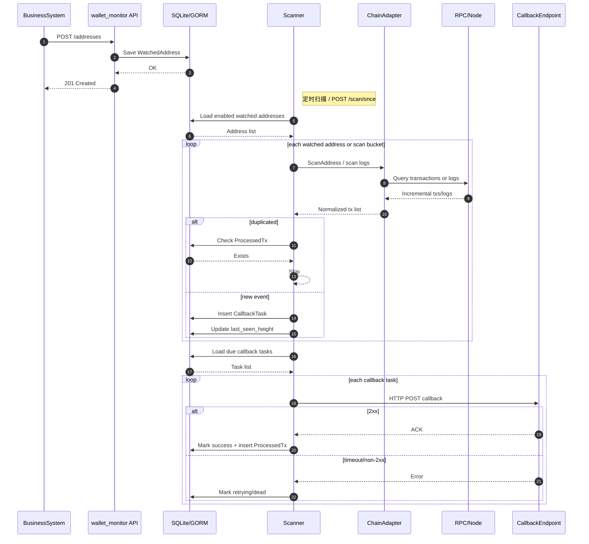

# 业务调用流程

本文档说明业务系统接入 `wallet_monitor` 后的调用链路，以及监控服务内部如何完成扫链、入队、回调和去重。

配套文件：
- Mermaid 源文件：`business_call_flow.mmd`
- SVG 图：`business_call_flow.svg`

## 1. 一句话说明

**业务系统只负责注册地址和接收回调；`wallet_monitor` 负责扫链、确认数判断、幂等去重、回调重试和死信管理。**

## 2. 主流程

### 2.1 注册监控地址
业务系统创建收款订单或生成收款地址后，调用：

- `POST /addresses`

监控服务会把监控目标写入 `WatchedAddress`，并初始化扫描进度：
- TRON / EVM 在未传 `start_height` 时，会把 `last_seen_height` 初始化为“当前已确认高度”，默认不回填历史
- 如需回填，必须显式传 `start_height`

### 2.2 定时扫描或手动触发
扫描由两种方式触发：
- 定时任务
- `POST /scan/once`

每轮扫描会读取所有 `enabled=true` 的地址，并按 `chain / asset_type` 选择适配器：
- `mock`
- `tron + native`
- `tron + trc20`
- `evm + erc20`

### 2.3 扫描命中新入账
当适配器发现新入账时，服务会执行以下动作：
1. 标准化为统一的 `Tx` 结构
2. 检查是否已成功处理过（`ProcessedTx`）
3. 若未处理，则尝试写入 `CallbackTask`
4. 在无致命错误的前提下推进 `last_seen_height`

### 2.4 回调投递
扫描阶段不会直接把“成功与否”作为唯一结果，而是先把回调任务持久化，再由任务执行器投递。

任务执行器会：
1. 读取到期的 `pending/retrying` 任务
2. 向 `callback_url` 发送 HTTP POST
3. 成功时将任务标记为 `success`，并写入 `ProcessedTx`
4. 失败时写入错误信息，并按指数退避安排重试
5. 超过最大重试次数后标记为 `dead`

## 3. 时序图

## 4. 关键控制点

### 4.1 幂等控制
系统通过两层控制避免重复通知：
- `CallbackTask` 唯一键：防止重复入队
- `ProcessedTx` 唯一键：防止重复成功投递

对于 EVM，同一笔交易里可能有多条 `Transfer`，因此唯一标识是：
- `tx_hash + log_index`

### 4.2 确认数控制
只有达到 `min_confirmations` 的交易才会被回调。

这意味着：
- 系统不会把未确认交易直接通知业务方
- 当前实现优先通过确认数降低 reorg 风险

### 4.3 回调安全控制
如果配置了 `-callback-secret`，每次回调会带：
- `X-WalletMonitor-Timestamp`
- `X-WalletMonitor-Signature`
- `X-WalletMonitor-Event-ID`

业务方必须做两件事：
1. 验签
2. 按事件 ID 做幂等

## 5. 当前适用范围

当前这条链路已适用于：
- 本地 mock 联调
- TRON 主网/测试网已确认入账扫描
- EVM ERC20 入账扫描

**该流程已经可以支撑单机部署场景下的实际入账监控，但高可用、多实例和更广泛多链能力仍属于后续演进项。**
